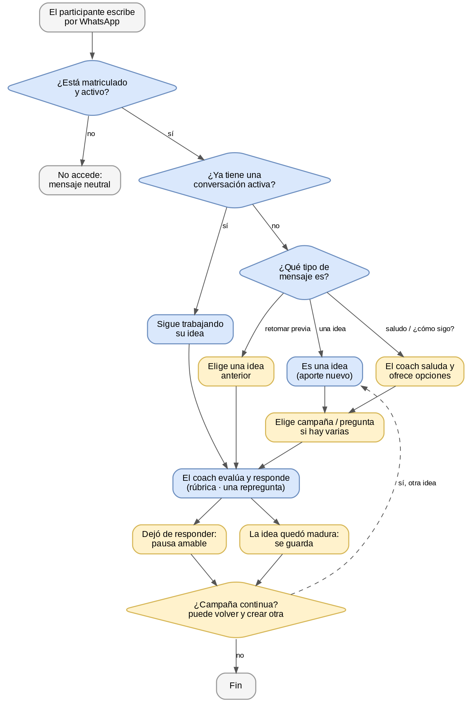

# Tejido de Red — Manual de uso para la convención

*Cómo funciona el sistema y cómo configurarlo — versión 2026-08-04*

Tejido de Red recoge ideas por WhatsApp: una persona escribe, un coach de inteligencia artificial conversa con ella, la ayuda a mejorar su idea con base en una rúbrica y guarda el resultado para revisarlo desde el portal. Este manual explica, en lenguaje sencillo, qué hace el sistema paso a paso y qué puedes ajustar en cada campaña.

**Dos tipos de ajustes.** Hay cosas que configuras tú en cada campaña desde el portal (el comportamiento del coach), y hay interruptores generales que enciende el equipo técnico una sola vez para todo el sistema. Separar estas dos cosas es la clave para entenderlo.

---

## 1. Cómo funciona: el recorrido del participante

El diagrama muestra qué pasa desde que una persona escribe hasta que su idea queda guardada. En **azul**, el flujo base (ocurre siempre). En **ámbar**, los puntos donde el comportamiento cambia según lo que activaste en esa campaña.

**Lectura rápida:** si la persona ya tiene una conversación abierta, el coach sigue con su idea. Si no, según lo que escriba, el coach la saluda, retoma una idea anterior o abre una idea nueva; luego evalúa y responde. La conversación cierra cuando la idea queda madura o cuando la persona deja de responder (pausa amable). Si la campaña es continua, puede volver y crear otra idea.

---

## 2. Qué configuras en cada campaña

Cada campaña tiene sus propios ajustes en el portal. Esta es la lista y qué hace cada uno.

| Ajuste | Qué hace | Recomendado para la convención |
|---|---|---|
| Estado de la campaña | Define si la campaña recibe aportes; debe estar activa para funcionar. | Activa durante el evento. |
| Mensaje inicial | El texto de bienvenida que llega por WhatsApp al arrancar. | Personalizado y aprobado por Meta. |
| Preguntas | Las preguntas sobre las que la gente aporta ideas. | Las definidas para la convención. |
| Rúbrica, guía del coach y modelo de IA | Con qué criterios evalúa el coach, cómo conversa y qué modelo usa. | La rúbrica congelada y el modelo configurado. |
| Permitir nuevas ideas después de finalizar | Deja la campaña abierta para que la persona vuelva y aporte más ideas. | Activado (queremos participación continua). |
| Repetir la idea para confirmar | El coach reformula la idea con sus palabras para asegurarse de que la entendió. | Activado. |
| Nivel de madurez para cerrar | Qué tan trabajada debe estar una idea para darla por lista. | Valor recomendado, por calibrar en las pruebas. |
| Tiempo de inactividad y pausa | Cuánto espera sin respuesta antes de despedirse de forma amable. | Alrededor de 5 minutos, con mensaje de pausa activado. |
| Varias ideas por persona | Permite que alguien aporte más de una idea, cada una por separado. | Activado. |
| Trabajar una idea a la vez | El coach afina una idea antes de pasar a la siguiente. | Activado. |
| Máximo de repreguntas | Cuántas veces el coach puede repreguntar para mejorar una idea. | 1 (valor por defecto). |
| Ideas semilla (opcional) | Textos que orientan o inspiran los aportes. | Opcional; según defina GHT. |
| Número de WhatsApp | Por cuál número responde la campaña. | El número del evento. |
| Límites de uso y costo | Topes de mensajes y gasto por persona, para proteger el sistema. | Activados (protección). |

---

## 3. Interruptores generales (los enciende el equipo técnico)

Estos no se tocan por campaña: se deciden una vez para todo el sistema, en la reunión de preparación del día del evento (acta de flags). Varios están terminados pero apagados por defecto.

| Interruptor | Qué hace | Estado para la convención |
|---|---|---|
| Responder cuando la persona escribe primero | El coach saluda y ofrece opciones aunque no haya una conversación abierta. | Recomendado encendido — por confirmar. |
| Pausa amable por inactividad | Envía un mensaje humano al pausar por falta de respuesta. | Recomendado encendido — por confirmar. |
| Retomar una idea anterior | Permite elegir y seguir una idea ya trabajada en el pasado. | Encender si está listo — por confirmar (en desarrollo). |
| Entender "paremos" / "otra idea" | Reconoce cuando la persona quiere parar o cambiar de idea. | Recomendado encendido — por confirmar. |
| Reinicio de datos | Herramienta interna de pruebas; borra conversaciones. | Apagado durante el evento. |

> **Nota:** "por confirmar" significa que la decisión final de encenderlos se toma en el acta de flags del día-D, después de las pruebas de calidad y costo.

---

## 4. Receta recomendada para la convención

Como en la convención habrá una sola campaña activa y continua, esta es la configuración recomendada, lista para usar. Ajústala si el equipo decide distinto en el acta del día-D.

- Campaña única, en estado activa, con "permitir nuevas ideas después de finalizar" encendido.
- El coach repite la idea para confirmar y trabaja una idea a la vez; permite varias ideas por persona.
- Nivel de madurez en el valor recomendado (a calibrar en pruebas); máximo de repreguntas en 1.
- Tiempo de inactividad de unos 5 minutos, con la pausa amable encendida.
- Interruptores generales recomendados encendidos: responder cuando la persona escribe primero, pausa amable, y entender "paremos/otra idea". Retomar ideas anteriores, si está listo.
- Límites de uso y costo encendidos; reinicio de datos apagado.
- Mensaje inicial personalizado y aprobado; número de WhatsApp del evento configurado.

---

## 5. Paso a paso del administrador

1. Crear la campaña en el portal y dejarla en estado activa.
2. Cargar o verificar la rúbrica, aprobar los textos guía del coach y elegir el modelo de IA.
3. Configurar las preguntas de la campaña.
4. Ajustar el comportamiento del coach: permitir nuevas ideas, repetir para confirmar, nivel de madurez, tiempo de inactividad, una idea a la vez y varias ideas por persona.
5. Cargar los participantes (carga masiva) con sus datos de área, empresa y variables demográficas.
6. Escribir el mensaje inicial y enviarlo; reenviar a quienes no respondan y reintentar los fallidos.
7. Con el equipo técnico, confirmar los interruptores generales antes de arrancar (acta de flags del día-D).
8. Durante el evento: revisar los resultados en el portal (lista de respuestas y su evaluación), distinguiendo ideas maduras de las que están en incubación.

*Con esto, cualquiera del equipo puede entender cómo se comporta el sistema y dejar una campaña bien configurada para la convención.*
